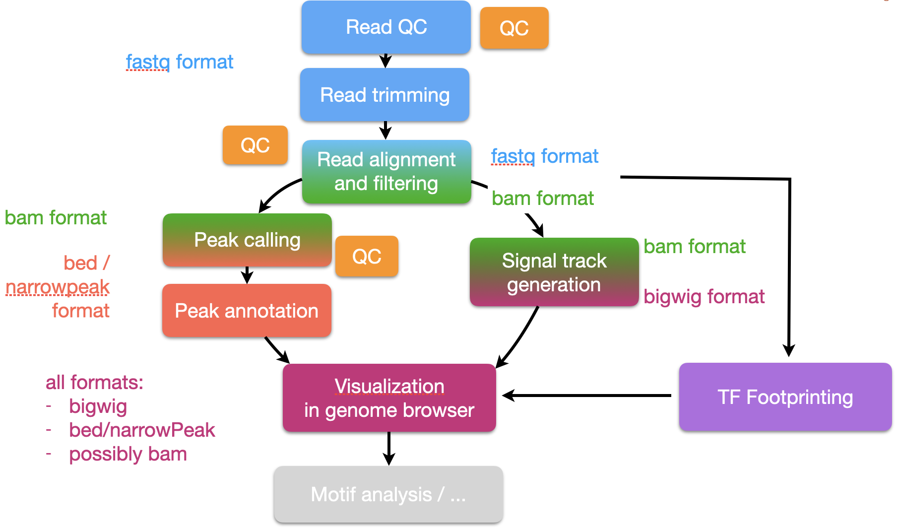

# 1. ATAC-seq : Background on the data



## Data background

In this workshop, we will analyse different genomic data generated from wild-type [HCT116](https://www.lgcstandards-atcc.org/products/all/CCL-247.aspx?geo_country=de#generalinformation) colon cancer cell-lines. These data will comprise of genome-wide chromatin accessibility measurements using **ATACseq**, histone modification of **H3K4me3** and **H3K4me1** marks and **CTCF** transcription factor binding using ChIPseq.

H3K4me3 is known to mark active promoters around their TSS, H3K4me1 are known to mark enhancer regions and the transcription factor CTCF is known to mediate enhancer-promoter interactions. Also, genomic regions of activity (active promoter or enhancers) are expected to have an open chromatin landscape to allow the binding of regulatory factors. Thus, integration of ATACseq data and ChIPseq data (H3K4me3, H3K4me1 and CTCF) from the same cell-line will give us an understanding of its regulatory landscape.

Raw data will be downloaded and re-processed from [`ENCODE`](https://www.encodeproject.org/) and the following data will be analyzed -

| Sample | Experiment | Assay                          | Replicate | Source   | 
| -------|------------|--------------------------------|-----------|----------|
| HCT116 | ATACseq    | Chromatin accessibility - R1   | 1         | [ENCFF121EPT](https://www.encodeproject.org/experiments/ENCSR872WGW/) |
| HCT116 | ATACseq    | Chromatin accessibility - R2   | 1         | [ENCFF795EHY](https://www.encodeproject.org/experiments/ENCSR872WGW/) |
| HCT116 | ATACseq    | Chromatin accessibility - R1   | 2         | [ENCFF624DNH](https://www.encodeproject.org/experiments/ENCSR872WGW/) |
| HCT116 | ATACseq    | Chromatin accessibility - R2   | 2         | [ENCFF157PAR](https://www.encodeproject.org/experiments/ENCSR872WGW/) |

## Download data
> NOTE: You don't need to download any data, all of the data has been pre-downloaded and saved in `home/<username>/data/fastqdata`. You will directly access these data during the practical training session.

### ATACseq
We will download the fastq files (2 isogenic replicates) containing sequence reads (paired end) from an ATACseq experiment done on the HCT116 cell-line from the ENCODE database.

```bash
wget https://www.encodeproject.org/files/ENCFF121EPT/@@download/ENCFF121EPT.fastq.gz \
-O ATAC_Rep1_ENCFF121EPT.fastq_R1.gz ;
wget https://www.encodeproject.org/files/ENCFF795EHY/@@download/ENCFF795EHY.fastq.gz \
-O ATAC_Rep1_ENCFF795EHY.fastq_R2.gz ;
wget https://www.encodeproject.org/files/ENCFF624DNH/@@download/ENCFF624DNH.fastq.gz \
-O ATAC_Rep2_ENCFF624DNH.fastq_R1.gz ;
wget https://www.encodeproject.org/files/ENCFF157PAR/@@download/ENCFF157PAR.fastq.gz \
-O ATAC_Rep2_ENCFF157PAR.fastq_R2.gz
```
### hg38 genome index
We will also download the precomputed hg38 genome index reference for allignment from iGenomes

```bash
wget http://igenomes.illumina.com.s3-website-us-east-1.amazonaws.com/Homo_sapiens/NCBI/GRCh38/Homo_sapiens_NCBI_GRCh38.tar.gz
```

## Public datasets
Often one has to use publicly available datasets. These datasets are widely available through [Gene Expression Omnibus - GEO](https://www.ncbi.nlm.nih.gov/geo/) and [Array Express](https://www.ebi.ac.uk/arrayexpress/). Raw data `fastq` from human samples are usually deposited in [The database of Genotypes and Phenotypes - dbGAP](https://www.ncbi.nlm.nih.gov/gap/) and [European Genome-phenome Archive - EGA](https://www.ebi.ac.uk/ega/home) and are available under protected access. These data are usually in `SRA` format and an array of tools called [sra-tools](https://github.com/ncbi/sra-tools) are available to manipulate these formats prior to regular analysis. We will not talk about these files formats in this workshop, but we want to make the participants aware that most of the publicly available raw ChIPseq and ATACseq data are in `SRA` format which needs to be converted to `fastq` format using `SRA-tools`.
