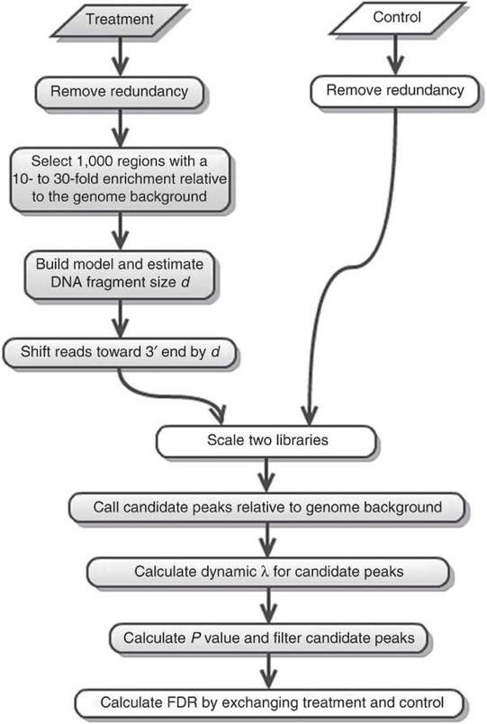

# 5. ChIP-seq : Peak Calling

Once the IP and control libraries have been aligned, and the aligned bam files filtered for low-quality reads, we want to determine the regions in which the IP signal is significantly higher than the control (=background) signal. This is called **peak calling**. There are many peak calling tools available, which are based on different statistical assumptions. We will use a widely used too called [MACS2](https://github.com/jsh58/MACS).

The workflow is the following:



## Narrow CTCF peak

```
# Go to your home directory
cd 

# Create a folder for your analysis
mkdir -p analysis/MACS2/CTCF

# Check out all the available parameters in MACS2
# Do note, when in doubt, its often good practice to use default settings
# Most options are optional and set to default, focus on the essential parameters that has to be changed

macs2 --help

# Launch the MACS2 peak calling
macs2 callpeak \
--treatment data/processed/CTCF/Bowtie2/CTCF_Rep1_ENCFF001HLV_trimmed_aligned_filt_sort_nodup.bam \
--control data/processed/CTCF/Bowtie2/CTCF_Control_ENCFF001HME_trimmed_aligned_filt_sort_nodup.bam \
--name CTCF \
--format BAM \
--keep-dup all \
--gsize 2.7e9 \
--qvalue 0.01 \
--outdir analysis/MACS2/CTCF

# Find you results here
cd analysis/MACS2/CTCF

# Genrate the figures for the model used by MACS2
/usr/bin/Rscript CTCF_model.r
```

## Broad H3K4me3 peak

```
# Go to your home directory
cd 

# Create a folder for your analysis
mkdir -p analysis/MACS2/H3K4me3

# Check out all the available parameters in MACS2
# Do note, when in doubt, its often good practice to use default settings
# Most options are optional and set to default, focus on the essential parameters that has to be changed

macs2 --help

macs2 callpeak \
--treatment data/processed/H3K4me3/Bowtie2/H3K4me3_Rep1_ENCFF000VCI_aligned_filt_sort_nodup.bam \
--control data/processed/H3K4me3/Bowtie2/H3K4me3_Control_ENCFF000VCW_aligned_filt_sort_nodup.bam \
--name H3K4me3 \
--format BAM \
--keep-dup all \
--gsize 2.7e9 \
--broad \
--qvalue 0.05 \
--broad-cutoff 0.05 \
--outdir analysis/MACS2/H3K4me3

```

> Analyze the outputs from MACS2, download the peaks `.xls` files using Cyberduck and check its contents

> Run the H3K4me3 peak calling **without** the `--broad` and `--broad-cutoff` option; i.e. in narrow peak finding mode. Do you get more/less peaks?

> Can you think of a reason why we keep `--keep-dup all` option ? Hint: think about the filtering steps used during alignment.

