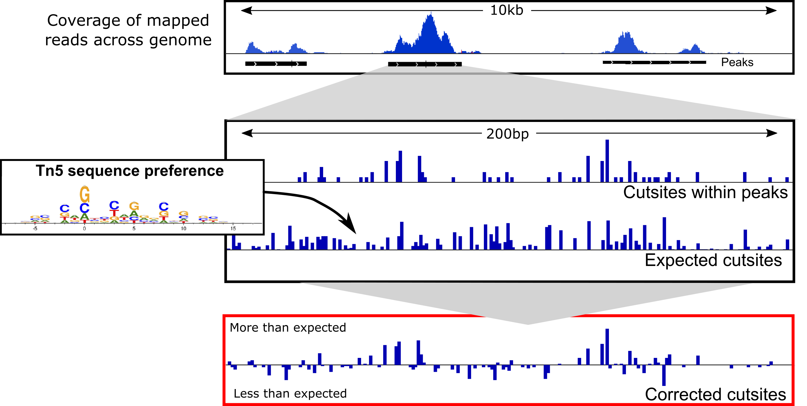
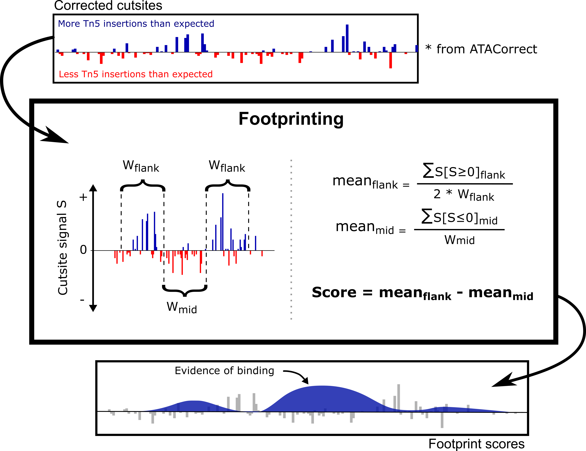

# 7. ATAC-seq : Footprinting analysis using [TOBIAS](https://github.com/loosolab/TOBIAS)

## Tn5 bias correction


*Figure taken from [TOBIAS](https://github.com/loosolab/TOBIAS)*

The function `ATACorrect` from **TOBIAS** is used for the following reasons -

- During ATACseq libtrary preparation, the Tn5 transposase binds to the open chromatin as a dimer and inserts two adapters separated by 9 bps. This has no major effect in peak calling, however, for footprinting analysis, the + and - strand are shifted by +4 bps and −5 bps repectively see [this](https://dx.doi.org/10.1038%2Fnmeth.2688) and [this](https://www.biostars.org/p/476698/). Doing so helps identify the center of the Tn5 binding.

- Though we expect Tn5 to bind randomly in open regions, in reality, Tn5 has a binding bias towards specific sequence. Thus, within a given open chromatin region, it's more likely to find the Tn5 cutsites over these specific sequences. This inherent bias needs to be corrected to identify the cutsites accurately. The function calculates the difference between the observed vs expected cutsites to correct for this bias. 

```
cd

mkdir -p analysis/Footprint

##################################################
#### THIS IS A LENGTHY PROCESS, DO NOT RUN IT ####
##################################################

TOBIAS ATACorrect \
--bam data/processed/ATACseq/Bowtie2/ATAC_REP1_aligned_filt_sort_nodup.bam  \
--genome data/ext_data/genome.fa \
--peaks analysis/MACS2/ATAC/ATAC-Rep1_peaks.narrowPeak \
--cores 3 \
--outdir analysis/Footprint/

```
## Footprinting scores


*Figure taken from [TOBIAS](https://github.com/loosolab/TOBIAS)*

Using the Tn5 bias corrected signals, this function estimates the footprints (i.e putative TF binding sites) within peak regions by identifying regions with depleted cutsite signal and flanked by high cutsite signal. Such a signal pattern indicates regions of TF binding.

```
cd

##################################################
#### THIS IS A LENGTHY PROCESS, DO NOT RUN IT ####
##################################################

TOBIAS ScoreBigWig \
--signal analysis/Footprint/ATAC_REP1_aligned_filt_sort_nodup_corrected.bw \
--regions analysis/MACS2/ATAC/ATAC-Rep1_peaks.narrowPeak \
--cores 3 \
--output analysis/Footprint/ATAC_footprints.bw 

```

## Transcription factor binding prediction


*Figure taken from [TOBIAS](https://github.com/loosolab/TOBIAS)*

Once the footprint regions are identified, one could look at the sequence at those regions and compare that with the TF binding motif sequence to estimate the TF binding propensity at the footprint regions. TF binding motifs are provided in standard JASPAR format.


**This step takes about ~7 minutes**

```
cd

mkdir -p analysis/Footprint/BINDdetect

TOBIAS BINDetect \
--motifs data/ext_data/motifs.jaspar \
--signals data/processed/ATACseq/Footprint/ATAC_footprints.bw  \
--genome data/ext_data/genome.fa \
--peaks analysis/MACS2/ATAC/ATAC-Rep1_peaks.narrowPeak \
--cores 3 \
--outdir analysis/Footprint/BINDdetect

```

Using Cyberduck, go to the folder generated (`analysis/Footprint/BINDdetect`). Check one of the folders (for exampe for CTCF):
* open the png file: what does it show?
* open the beds folder: do you understand what the content represents?

## Task - integrative analysis

Using Cyberduck download these files to you local machine - 

**CTCF**

1. `/analysis/MACS2/CTCF/CTCF_peaks.narrowPeak`
2. `/analysis/bigwig/ChIP/CTCF_ses_subtract.bw`

**ATAC**

3. `/analysis/MACS2/ATAC/ATAC-Rep1_peaks.narrowPeak`
4. `/analysis/bigwig/ATAC/ATAC_REP1.bw`

**Footprints**

3. `/data/processed/ATACseq/Footprint/ATAC_REP1_aligned_filt_sort_nodup_corrected.bw`
4. `/analysis/Footprint/BINDdetect/CTCF_MA0139.1/beds/CTCF_MA0139.1_ATAC_footprints_bound.bed`

Load these track in [IGV](https://igv.org/app/) and try to answer the following -

1. Do the `.bigwig` peaks and the MACS2 called `.narrowPeak` correspond in CTCF
2. Do the `.bigwig` peaks and the MACS2 called `.narrowPeak` correspond in ATAC
3. Are there region where CTCF and ATAC peaks overlap
4. You have been working with HCT116 cell-line (colon cancer), [here](https://www.omim.org/entry/114500) is a list of genes implicated in colon cancer
4. Can you find CTCF/ATAC overlapping peak regions at the promoter regions or enhancer regions of these genes
5. 

