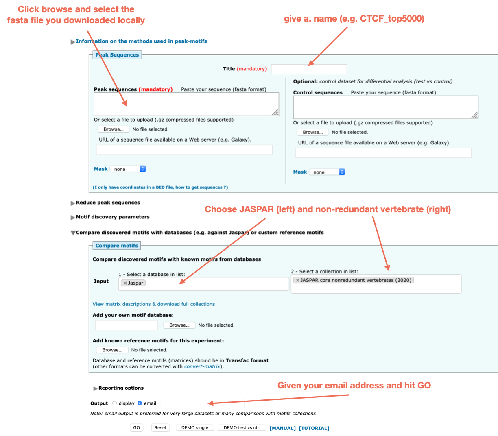
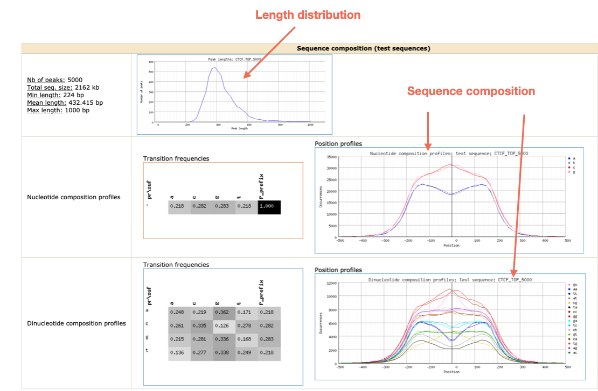
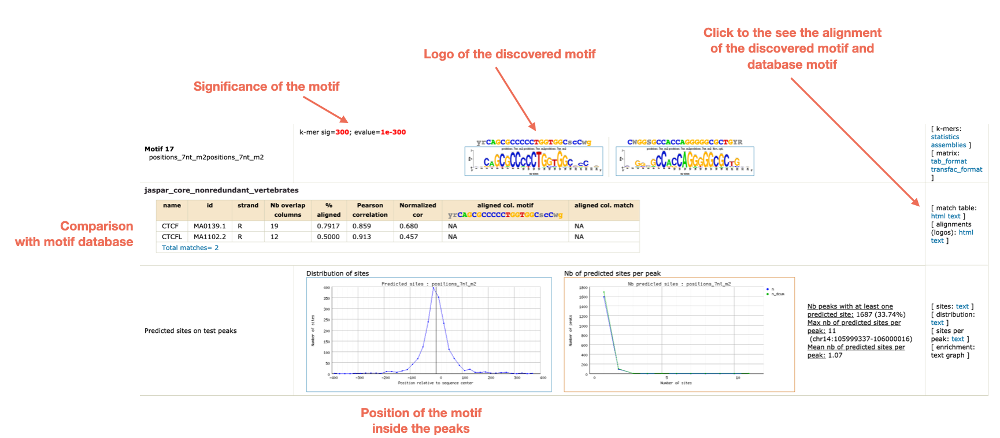

# 10. Motif analysis CTCF ChIP-seq

One important step of the secondary analysis in ChIP-seq is the motif analysis. This can be done either for peaks obtained from histone marks, such as H3K27ac, in order to find potential binding transcription factors in regions marked by specific histone marks.
But this also makes sense to do this motif analysis in transcription factor ChIP-seq peaks; the reasons are:
1. **Quality control**: do I find the expected TF motif in the ChIP peaks?
2. **Finding co-factors**: motif analysis can highlight, besides the expected TF motif, further motifs indicating possible co-factors.

We will run a simple motif analysis on the **CTCF ChIP-seq peaks**, using a motif analysis tool called [peak-motif](http://rsat.sb-roscoff.fr/peak-motifs_form.cgi) from the [RSA Tools](http://rsat.sb-roscoff.fr/) tool box.

## Steps in motif analysis

We will proceed with the following analysis steps:

1. **Extracting the top CTCF peaks**: since we have a large number of CTCF peaks (> 50,000), we will extract the top 5000 peaks from the narrowPeak file, based on the enrichment score.

2. **Getting fasta sequence**: for the motif analysis, we need the fasta sequence of the corresponding peaks; this can be obtained using the `bedtools` toolbox.

3. **Running motif discovery**: we will submit these sequences to *peak-motif* and run a **motif discovery** analysis

4. **Identifying discovered motifs**: we will then use a feature of *peak-motif* to compare the discovered motifs with known motifs from the motif database [JASPAR](http://jaspar.genereg.net/).


## Hands on!

### 1. Obtaining the top 5000 narrow peaks

The narrow peak file obtained from MACS2 contains a column with a score value; we will sort the file in decreasing order according to this column, and take the top 5000 lines:

```bash
## go back to your home folder
cd
mkdir -p analysis/rsat/CTCF

sort -nr -k7 analysis/MACS2/CTCF/CTCF_peaks.narrowPeak \
| head -n 5000 > analysis/rsat/CTCF/CTCF_peaks.top5000.narrowPeak
```

### 2. Obtain the corresponding fasta sequences

```bash
bedtools getfasta -fi data/ext_data/genome.fa \
-bed analysis/MACS2/CTCF/CTCF_peaks.top5000.narrowPeak > analysis/rsat/CTCF/CTCF_peaks.top5000.fa
```

Using CyberDuck, open the directory `analysis/rsat/CTCF`, and download the fasta file `CTCF_peaks.top5000.fa`  to your local disk

### 3. & 4. Running RSAT peak-motif analysis

1. Go to the [peak-motif form](http://rsat.sb-roscoff.fr/peak-motifs_form.cgi)
2. Fill the following information
   * name of the study
   * fasta file with peak sequences
   * motif database to compare the results with
   * email



Check your email; you should have an email from `rsat` with `Job submitted` in the subject. 

* Open the email and click on the link;
* The page will update itself every 2 minutes, and new results will appear.

Once the results are completed, you will see a full report; check the following sections, and explore the report!






> Which motifs have been identified?

> Can you find a CTCF-like motif?

> Can you  find other motifs besides CTCF?
