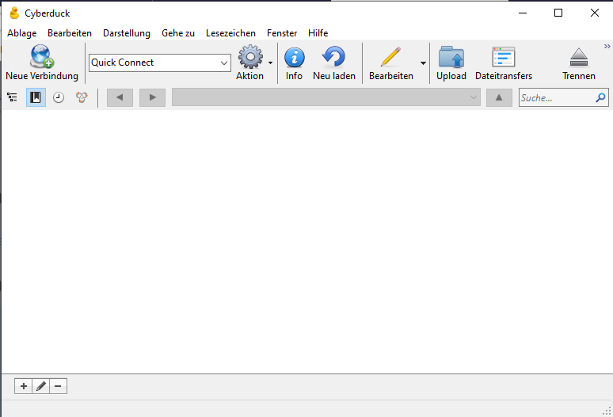
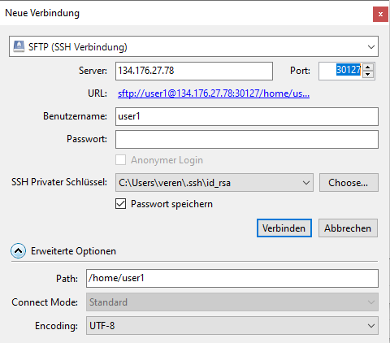

## Installing and configuring Cyberduck

In order to access remote files (for example opening a pdf file), you will need to install an additional tool, called [cyberduck](https://cyberduck.io/).

1. Install Cyberduck according to your operating system
2. Once installed, open Cyberduck
3. On the top left, click on `Neue Verbindung`(or `new connection`)

4. In the new window, make the following changes:
   * select `sftp` in the dropdown menu
   * in the `server` box, type `134.176.27.78`
   * in the `port` box, type `30127`
   * in `Benutzername` (or `Username`), type your username (like `user1`)
   * leave the password box empty
   * in `Privater ssh Schlüssel` (or `private ssh key`), select the file `id_rsa` in the `.ssh` subfolder in your home folder *(WARNING: make sure that you DO NOT select `id_rsa.pub`!)
   * in `erweiterte Optionen`, in the `path` box, type `/home/user1` (change the username accordingly!)

   

5. Click on `Verbinden` (or `Connect`)