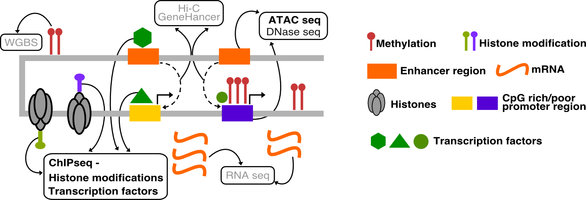

# ChIP-seq and ATAC-seq Bioinformatics Analysis Workshop

Welcome to the **workshop on the computational analysis of ChIP-seq and ATAC-seq data.** This workshop is meant for individuals with little to no previous knowledge of bioinformatics. We will guide you through each of the main steps of the bioinformatic analysis.

******
## Tutors

* Carl Herrmann, [Health Data Science Unit](https://www.hdsu.org/) Medical Faculty Heidelberg and BioQuant (carl.herrmann@bioquant.uni-heidelberg.de)
* Ashwini Sharma, [Health Data Science Unit](https://www.hdsu.org/) Medical Faculty Heidelberg and BioQuant (ashwini.sharma@bioquant.uni-heidelberg.de)

********

## Slides

* [Part 1 - general intro](./chipatac2020_part1.pdf)

********
## Practical parts

* [General instructions before you start](./00_generalInstructions.md)
* Make sure to protocol your progress [in this Google Sheet](https://docs.google.com/spreadsheets/d/1LDP_A7_5BJCrq2nWaObHVKb3ZSRMPCWobFNEcVNSwGk/edit?usp=sharing)

### Day 1: ChIP-seq                                         

1. [Introduction](./01_CHIP_Intro.md)                             
2. [Quality control on reads](./02_CHIP_ReadQC.md)                  
3. [Read trimming](./03_CHIP_Trimming.md)                          
4. [Read alignment](./04_CHIP_Alignment.md)                        
5. [Peak calling](./05_CHIP_PeakCalling.md)                         
6. [Peak annotation](./06_CHIP_PeakAnnotation.md)                   
7. [ChIP-seq quality control](./07_CHIP_QC.md)                      
8. [Generating signal tracks and using IGV](./08_CHIP_bigwig.md)    
                                                   

### Day 2: ATAC-seq

#### Due to time constraints, please start with part 5, and skip parts 1-4 for the moment!!
1. [Introduction](./01_ATAC_Intro.md)
2. [Quality control on reads](./02_ATAC_ReadQC.md)
3. [Read trimming](./03_ATAC_Trimming.md)
4. [Read alignment](./04_ATAC_Alignment.md)

5. [Peak calling](./05_ATAC_PeakCalling.md)
6. [Peak annotation](./06_ATAC_PeakAnnotation.md)
7. [Footprinting](./07_ATAC_Footprinting.md)
8. [ATAC-seq quality control](./08_ATAC_QC.md)
9. [Generating signal tracks and using IGV](./09_ATAC_bigwig.md)

### Day 2: Going further: integrating/comparing ChIP-seq/ATAC-seq

10. [Motif analysis on CTCF peaks](./10_motifCTCF.md)

********
## Schedule

The course will run over 2 days (Monday, 14.12 and Tuesday, 15.12) from 10 am - 12.30 pm and 1.30 pm - 5.30 pm.

Check the detailed schedule [here](./schedule.md)

*********
## Organisation

The course will be online only! 
* Lectures will be over **Zoom** (use [this link](https://us02web.zoom.us/j/87513196823?pwd=VURGZkRVZWxzMTFhZkFvaHhiL0s4dz09))
* We will use **Discord channels** for the practical sessions (register [using this link](https://discord.gg/xNpc66eZbW))

**********
## Technical pre-requisites

All the computation will be done on the cloud of the [German Bioinformatics Network de.NBI](https://www.denbi.de/). All you need is a personal laptop to access the cloud server. 

Check the technical pre-requisites, depending on whether your operating system is Windows, MacOS or Linux

1. Generating ssh-keys and connecting to the server: instructions for all operating systems are [here](./ssh.md)
2. Installing Cyberduck to access remote files: instructions are [here](./cyberduck.md)
3. Installing RStudio: instructions are [here](./rstudio.md)
